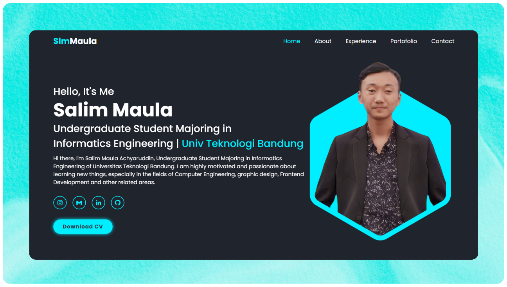

# About The Project

This is my personal website, designed to showcase my portfolio and provide information about myself, my skills, and the projects I've worked on. The website is fully responsive for all devices, ensuring optimal viewing and interaction experience across a wide range of devices.

### Screeshots Demo



### Live Demo

Visit the following link to view the [Live Demo](https://slmmaula.vercel.app)

### Tech Stack

<details>
  <summary>Client</summary>
  <ul>
    <li><a href="https://developer.mozilla.org/en-US/docs/Web/Guide/HTML/HTML5">HTML</a></li>
    <li><a href="https://developer.mozilla.org/en-US/docs/Web/CSS">CSS</a></li>
    <li><a href="https://developer.mozilla.org/en-US/docs/Web/JavaScript">JavaScript</a></li>
    <li><a href="https://boxicons.com/">Boxicons</a></li>
    <li><a href="https://scrollrevealjs.org/">Scroll Reveal</a></li>
    <li><a href="https://mattboldt.com/demos/typed-js/">Typed.js</a></li>
  </ul>
</details>

<details>
  <summary>Tools</summary>
  <ul>
    <li><a href="https://sweetalert2.github.io/">SweetAlert</a></li>
    <li><a href="https://smtpjs.com/">SMTP.js</a></li>
    <li><a href="https://favicon.io/favicon-converter/">Favicon</a></li>
  </ul>
</details>

<details>
  <summary>Hosting</summary>
  <ul>
    <li><a href="https://vercel.com/">Vercel</a></li>
    <li><a href="https://pages.github.com/">GitHub Pages</a></li>
  </ul>
</details>

### Features

* Responsive design using HTML, CSS, and JavaScript.
* Smooth scrolling using Scroll Reveal.
* Animated text using Typed.js.
* Hamburger icon for mobile navigation, ensuring easy access to site navigation on smaller screens.
* About section providing a brief introduction and overview about my self.
* About page for detailed information about myself, my background, and my skills.
* Experiences section highlighting my professional experiences and achievements, including a brief description, image, and links to full details
* Portfolio section showcasing my projects, including a brief description, image, and link to the project's
* Contact form with validation using SweetAlert and SMTP.js.

### Project Logo


### Project Web Icon


### Color Reference

| Color                      | Hex                                                              |
| -------------------------- | ---------------------------------------------------------------- |
| Main Color                 |  #0ef          |
| Text Color                 |  #fff          |
| Background Color           |  #1f242d |
| Secondary Background Color |  #323946 |

<br />

# Getting Started

### Prerequisites

Before you begin, ensure you have met the following requirements:

* [Git](https://git-scm.com/downloads "Download Git") must be installed on your operating system.

### Run Locally

To run **Slmmaula - Personal Web** locally, run this command on your git bash:

Linux and macOS:

```bash
sudo git clone https://github.com/Slmmaula/personal-web.git
```

Windows:

```bash
git clone https://github.com/Slmmaula/personal-web.git
```

# Contact

If you want to contact with me you can reach me at [Instagram](https://www.instagram.com/slmmaula_) - [Email](contact.slmmaula@gmail.com).

# Support

<a href="https://saweria.co/slmmaula" target="_blank"></a>

# License

This project is **free to use** and does not contains any license.
